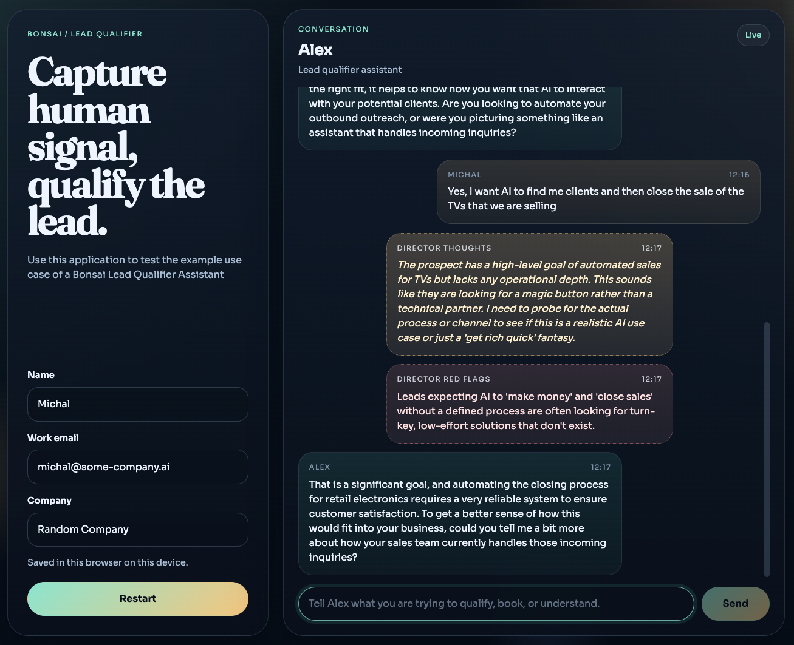

  <picture>
    <source media="(prefers-color-scheme: dark)" srcset="./images/bonsai-logo-h-w.svg">
    <source media="(prefers-color-scheme: light)" srcset="./images/bonsai-logo-h.svg">
    
  </picture>

# Bonsai Examples

A collection of ready-to-run example projects built with [Bonsai](https://github.com/utter-one/bonsai) — the open-source framework for safe, brand-grade AI agents. Each example includes a Bonsai project file you can import directly, any integration scenarios, and a sample frontend where applicable.

## Examples

### [Lead Qualifier](./lead-qualifier)

An AI sales-qualification assistant that qualifies inbound leads through natural conversation, scores them against a BANT matrix, and books a discovery call on Google Calendar — all without a human in the loop until the call itself.

You can find more details in the [readme](./lead-qualifier/readme.md)  and a step-by-step guide in [setup guide](./lead-qualifier/setup.md). We have also added a [sample web app](./lead-qualifier/sample-webapp) to show how easy you can add a frontend to your Bonsai project (screenshot below).

## License

Apache 2.0 — see [LICENSE](./LICENSE).
